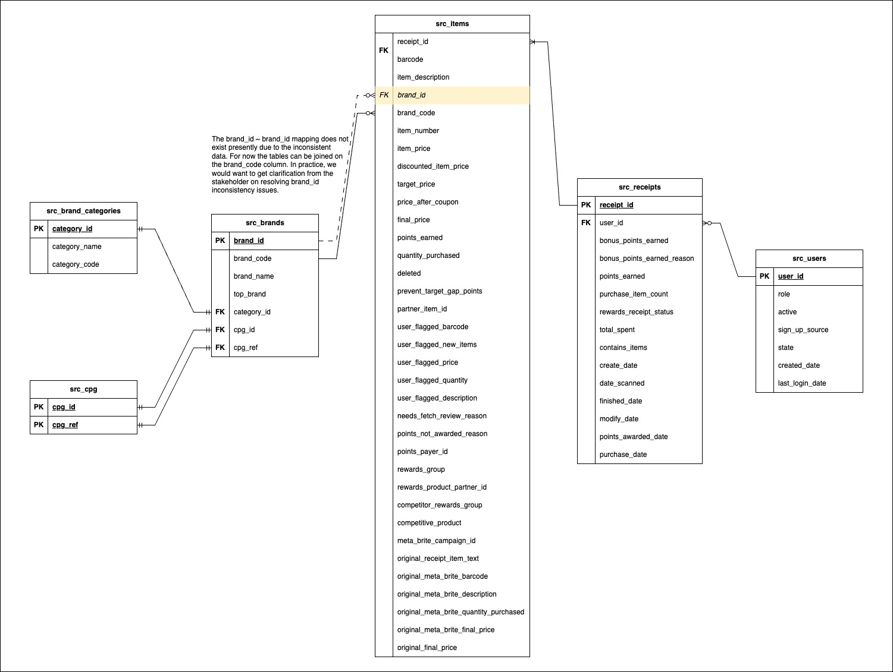

# Fetch Rewards Analytics Engineer Task

This repository contains my submission for the Analytics Engineer position at Fetch Rewards.
The problem statement and description can be found by clicking [here](https://fetch-hiring.s3.amazonaws.com/analytics-engineer/ineeddata-data-modeling/data-modeling.html)

The data warehouse that is being used for this project is Postgres. While traditionally, it is not used as a data warehouse, I have chosen to use it since it is open source and relatively lightweight.

As a consequnce the **dialect of SQL used is PostgreSQL SQL**.

The submissions to the 4 requirements are outlined in the following sections of the document. 

Further implementation details are detailed after the task requirements.

# Steps to run this project

This section of the document details how to run this project as it is on your local system. Please note, that to do so, you will require Python and PostgresSQL to be installed on your local system. 

In case you do not want to run the data processing of the raw files and load to Postgres, but are just interested in the final tables that have been created, there are CSV extracts in the `src_table_data_extracts/` directory. Simply load the CSVs into a data warehouse of your choice, and you can query the data as found in the ER diagram [here]('./fetch-ER-diagram.jpg').
*Please note that all the queries that are in this repository are written and supported by PostgreSQL. Running the queries/sql directly on a different platform/data warehouse could have issues.*

### Instructions to run:
To run the source code, at the very minimum you will need Python and PostgresSQL to be installed on your system. 
Adding python to your HOME will make the execution of this code easier.

1. Clone this repository to your system `git clone https://github.com/varun1210/Fetch-Rewards-Analytics-Engineer.git`.
2. Navigate to the root of this repository `cd fetch-rewards-analytics-engineer`. 
3. Create a python virtual environment `python -m venv .`.
4. Activate the virtual environment. `source bin/activate` (Linux-based OS, Mac)/`\Scripts\activate.bat` (Windows OS).
5. Install the required dependencies by running the `pip install -r requirements.txt`
6. Create a database in PostgreSQL with a name of your choice.
7. Open the `constants.py` file and edit the database connection configurations. 
8. Run the `create_src_tables.py` file. `python create_tables.py`

For more information on Python virtual environemnts, please click [here](https://docs.python.org/3/library/venv.html)
For more information on PostgreSQL, please click [here](https://www.postgresql.org/)

Once the source tables have been created, you can look around the data schema and run queries on the tables. 


# Requirements Fulfillement 

## **First: Review Existing Unstructured Data and Diagram a New Structured Relational Data Model**
The ER diagram to convert the unstructured model to a structured model is shown below.


## **Second: Write queries that directly answer predetermined questions from a business stakeholder**

*SQL file located in `task_requirement_dml/requirement_4.sql`*

1. What are the top 5 brands by receipts scanned for most recent month?
All the items purchased in the most recent month (March 2021) do not have a brand code associated with them/or are unbranded items like produce. So, there are no top 5 brands scanned for the most recent month. 
One thing to note is that I have assumed "top 5 brands" to mean "top 5 brands that have sold the most number of items". In case we are looking for "top 5 brands that have the most sales", we can modify the query accordingly. 
In a real-world scenario, it would be best to confirm what the stakeholders' definition of "top 5 brands" is.
```
with month_year as (
    select distinct
	extract(month from date_scanned) as month,
	extract(year from date_scanned) as year
    from src_receipts 
),
months_ago as (
    select month, year, 
	row_number() over(order by year desc, month desc) as months_ago
    from month_year
),
recent as (
    select month, year 
    from months_ago where months_ago = 1
),
receipts as (
    select receipt_id
    from src_receipts r
    inner join recent rec
    on extract(year from r.date_scanned) = rec.year
    and extract(month from r.date_scanned) = rec.month
),
items as (
    select i.brand_code
    from src_items i
    inner join receipts r
    on i.receipt_id = r.receipt_id
    where i.src_file = 'receipts.json'
),
brands as (
    select brand_name, brand_code
    from src_brands
)
select i.brand_code, b.brand_name, count(*)
from items i
left join brands b
on b.brand_code = i.brand_code
group by i.brand_code, b.brand_name
order by count(*) desc
limit 5;
```

2. How does the ranking of the top 5 brands by receipts scanned for the recent month compare to the ranking for the previous month?
All the items purchased in the most recent month (March 2021) do not have a brand code associated with them/or are unbranded items like produce. For the previous month (February 2021), the top 5 brands by items purchased are: 
    - unbranded items/no brand code: 186
    - brand_code "BRAND" (no brandName associated): 3
    - brand_code "MISSION" (no brandName associated): 2
    - Viva: 1
Same assumption regarding the definition of "top 5 brands" from the previous query applies here as well.
```
with month_year as (
    select distinct
	extract(month from date_scanned) as month,
	extract(year from date_scanned) as year
    from src_receipts 
),
months_ago as (
    select month, year, 
	row_number() over(order by year desc, month desc) as months_ago
    from month_year
),
recent as (
    select month, year 
    from months_ago where months_ago = 2
),
receipts as (
    select receipt_id
    from src_receipts r
    inner join recent rec
    on extract(year from r.date_scanned) = rec.year
    and extract(month from r.date_scanned) = rec.month
),
items as (
    select i.brand_code
    from src_items i
    inner join receipts r
    on i.receipt_id = r.receipt_id
    where i.src_file = 'receipts.json'
),
brands as (
    select brand_name, brand_code
    from src_brands
)
select i.brand_code, b.brand_name, count(*)
from items i
left join brands b
on b.brand_code = i.brand_code
group by i.brand_code, b.brand_name
order by count(*) desc
limit 5;
```

3. When considering average spend from receipts with 'rewardsReceiptStatus’ of ‘Accepted’ or ‘Rejected’, which is greater?

NO DATA AVAILABLE FOR 'rewardsReceiptStatus’ = 'Accepted', will require further clafification from stakeholder

4. When considering total number of items purchased from receipts with 'rewardsReceiptStatus’ of ‘Accepted’ or ‘Rejected’, which is greater?

NO DATA AVAILABLE FOR 'rewardsReceiptStatus’ = 'Accepted', will require
further clafification from stakeholder

5. Which brand has the most spend among users who were created within the past 6 months?


```
with month_year as (
	select distinct extract(month from created_date) as month,
	extract(year from created_date) as year
	from src_users
),
months_ago as (
	select month, year, row_number() over(order by year desc, month desc) as months_ago
	from month_year
),
recent as (
	select month, year 
	from months_ago where months_ago < 7
),
users as (
	select usr.user_id
	from src_users usr
    inner join recent rec
    on extract(month from usr.created_date) = rec.month
	and extract(year from usr.created_date) = rec.year
),
receipts as (
	select rcpts.receipt_id
	from src_receipts rcpts
    inner join users usr
    on rcpts.user_id = usr.user_id
),
items as (
	select itm.brand_code, sum(itm.final_price) as total_spent
	from src_items itm
    inner join receipts rcpts
	on itm.receipt_id = rcpts.receipt_id
	group by itm.brand_code
), 
brands as (
	select distinct brand_code, brand_name from src_brands
)
select items.brand_code, brands.brand_name, sum(total_spent) as total_spent
from items
left join brands
on items.brand_code = brands.brand_code
group by items.brand_code, brands.brand_name
order by total_spent desc;
```

6. Which brand has the most transactions among users who were created within the past 6 months?
```
```

## **Third: Evaluate Data Quality Issues in the Data Provided**

*The queries used to find these data quality issues have been stored in `task_requirement_dml/requirement_3.sql`*

1. Users JSON file
    - Multiple duplicates found (283)
    - Multiple users found where role is not “consumer” but instead “fetch-staff”
    - Multiple fields contain null values

2. Brands JSON file:
    - Found 7 duplicate barcodes. All these duplicate barcodes have more than one value for brand information (brandId, brandCode, topBrand, name), category information (category) and cpg information (cpgId)
    - brandCode information is highly inconsistent. Some records contain data from barcode key ( ex. "511111705239"), many of them have values of the form (“TEST BRANDCODE @1598813527796”)
    - name information also contains many values of the form (“test brand @1607312508610”)
    - Multiple fields contain null values

3. Receipts JSON file:
    - There exist receipts of some users (117 users) who do not exist in the receipts file.
    - A lot of receipts (440) do not have any receipt items. All these records also have most columns containing null values.
    - For many of the records, within the "rewardsReceiptItemList" key, many of the receipt items do not have a barcode. 
    - For many of the records, the items in the receipts have barcodes in various formats, some of which may be invalid. (ex. “B076FJ92M4”, “4011”).
    - For many of the records, within the "rewardsReceiptItemList" key, many of the receipt items do not have a don’t have a description for the item. 
    - Many of the receipt items contain a brand code that does not exist in the brands file.
    - The data in this file generally has a large amount of missing values. 

## **Fourth: Communicate with Stakeholders**

Hi Stakeholder,

Hope you are doing well!

Our team has just completed an analysis of the three files you have sent us for revieiw. We have a couple of questions regarding the data in the files, and some validations we require from you to help us model the data better to facilitate insights. Can you please provide some clarification and input regarding the following:

1. What should we do with the records from users.json file where role is not "CONSUMER". Should we retain these records or ignore them?

2. In the brands.json file, there is a "barcode" key for the item. The rest of the keys seem to exclusively contain brand related information. Is there a reason the "barcode" belongs in this file? 
For now, we have taken the data in the key and combined it with the items data in the 
"rewardsReceiptItemList" to try to generate an "items" table. We have also included a 
flag column to indicate which file the item information was populated from. Would this adversely impact our usecase in any way/does this not accurately represent the business definition of this key?

3. In the brands.json file, there is some information under the "cpg" key. Does this refer to "consumer packaged goods"? Additionally, all the records in the file have a "cpgRef" value equal to 'Cogs'. What does this mean? Can we get some more context into the "cpg" key and how this information fits into the rest of the schema? Are there any insights we want to derive from this information now or in the future?

4. In our analysis, we have discovered in the brands.json file that the "categoryCode" is null for a lot of the records. Taking a look at the data, we realized that the "categoryCode" can be deduced from the category column. (Ex. "categoryCode": HEALTH_AND_WELLNESS corresponds to "category": Health & Wellness, PERSONAL_CARE corresponds to Personal Care, etc.). For now, we have populated the null values for "categoryCode" in this way. Is this okay, or do you anticipate some issues with this in the future?

5. In the receipts.json file, there are many (440) receipts that do not have any items in them. All of these receipts also contain null values except for the keys "createDate", "dateScanned", "modifyDate", and "rewardsReceiptStatus". Furthermore, through analysis, we discovered that the timestamps recorded within these date keys are identical. Does this mean they are invalid receipts? If this is the case, will we require them now or in the future?

6. In the receipts.json file, the records have a key named "rewardsReceiptItemList". We do not have a data schema to understand what a lot of the keys mean. Can we get some more context/information for what these fields mean? 

7. For now, we have constructed an "items" table using the data from the "barcode" key
in the brands.json file and some data from the items in the "rewardsReceiptItemList" key in the receipts.json file. Because of this, the table is very inconsistent. Can we get more data pertaining to the items?

8. The barcodes of the items in the "rewardsReceiptItemList" are of various formats. 
We are unsure of whether some of the barcodes are valid or not. (Ex. "B076FJ92M4", "4011"). Is there a set of constraints on how a barcode should be? If there is, can we get some more information so we can determine which records are valid?

9. There is a key named "itemNumber" for some of the items (153 items) in the receipts. 60 of these records have the same value for "itemNumber" as they do for "barcode". Is this key relevant? 

10. There exist receipts of some users (117 users) in the receipts.json file who do not exist in the users.json file. Should we retain these receipt records?

11. There are two keys "barcode" and "userFlaggedBarcode" in the receipts.json file items in the receipts. We observed that "barcode" value is always either null or equal to "userFlaggedBarcode". Furthermore, "userFlaggedBarcode" is always either null or equal to "barcode". Can these two keys be used interchangably? 

12. There are a large number of null values for items in the "rewardsReceiptItemList" key. What is the most appropriate way you like us to handle these values?

13. For many of the items in the "rewardsReceiptItemList" key, there are many brand coes for items that aren't in the brands file. Can we use the data in these files to further complete the brands dataset?

In addition, we have some concerns related to scaling with our current process. Here are some considerations for the future to facilitate better scaling. 
1. The data being provided to us is in the form of flat files. While this works okay for the number of records in the files now, it can create serious ingestion bottlenecks in case the data increases. Is there a way we can connect directly to the source of the data being produced and load it to our staging layer from there? This would not only reduce bottlenecks, but would also automate the process of data ingestion, eliminating the dependence of the stakeholder to give us the flat file.

2. The data is in an unstructured form. If possible, we should try to get it in structured form for better schema enforcement and modelling. Leaving the data unstructed makes it very difficult to add new tables and relations in the future, in case they do arise. 


Thank you so much for taking the time to read this email. Please let me know if you require further clarifications regarding our questions/suggestions. Any further inputs/suggestions that you have are also welcome. 

Thanks!

Regards,
Varun Muppalla


# Implementation Details

This project tries to simulate a small-scale ELT pipeline for ingesting the data in the the raw gzip files provided in the exercise. 

The code to perform the ingestion is located in the `ingestion_scripts` directory. The code is primarily written in Python.

Python has been used to 

